<div align="center">

# NexusTrace

**Criminal network analysis for investigators: map who is connected to whom, read case documents with an in-browser NLP engine, and see why the system flags what it flags.**

Built by **Team Veridex** for **Smart India Hackathon 2026** · Problem statement **SIH26189** (Ministry of Home Affairs)


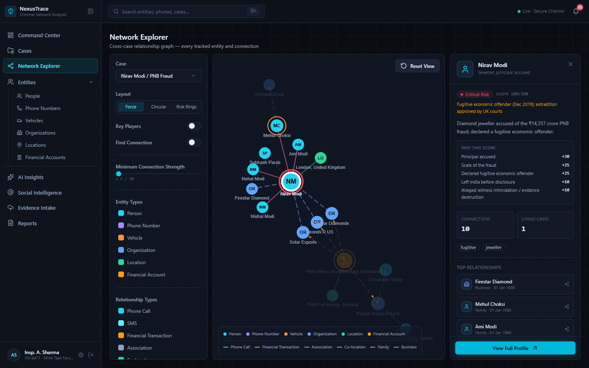

</div>

## What it does

- **Network graph across cases.** Every person, company, phone, vehicle, place and bank account in ten real, publicly documented Indian cases, with the links between them. Filter by case, entity type or connection strength, switch layouts, rank key players by centrality, and find the shortest path between any two entities.
- **Explainable risk scores.** Each score is the sum of listed reasons (for example "Principal accused +30", "Declared fugitive economic offender +25"), each backed by a source link, so the number can never disagree with its explanation.
- **NLP that runs in the browser.** Paste an FIR, a news report or a court order and the engine picks out people, organisations, places, vehicle plates, phone numbers, accounts, amounts, dates, legal sections and social media handles, matches them to entities already in the graph, and proposes links for an investigator to review. No API calls and no model download; it takes a few milliseconds.
- **Patterns found in the network itself.** Cross-case links (the same bank in two frauds), the most connected nodes, and people who left the jurisdiction, each with a confidence and a way to review it.
- **Bulk case import** from CSV or Excel, with column matching, a preview and per-row warnings.
- **Social media intelligence** for public figures and organisations only, sourced from Wikidata. Private individuals, victims and people accused of terrorism are deliberately not searched.
- **Secure by default.** Password + authenticator app (TOTP) for everyone, 10 one-time backup codes, bcrypt, rate limits, encrypted uploads, per-site sessions, and an audit log of every administrative change.
- **Admin-approved accounts.** New sign-ups attach their department, position and ID proof, then wait until an administrator approves them. Administrators can also suspend, restore, edit or permanently delete accounts.
- **Six languages and four themes.** English, हिन्दी, मराठी, বাংলা, தமிழ் and తెలుగు, plus two dark and two light colour themes.

## Screenshots

<table>
<tr>
<td width="50%">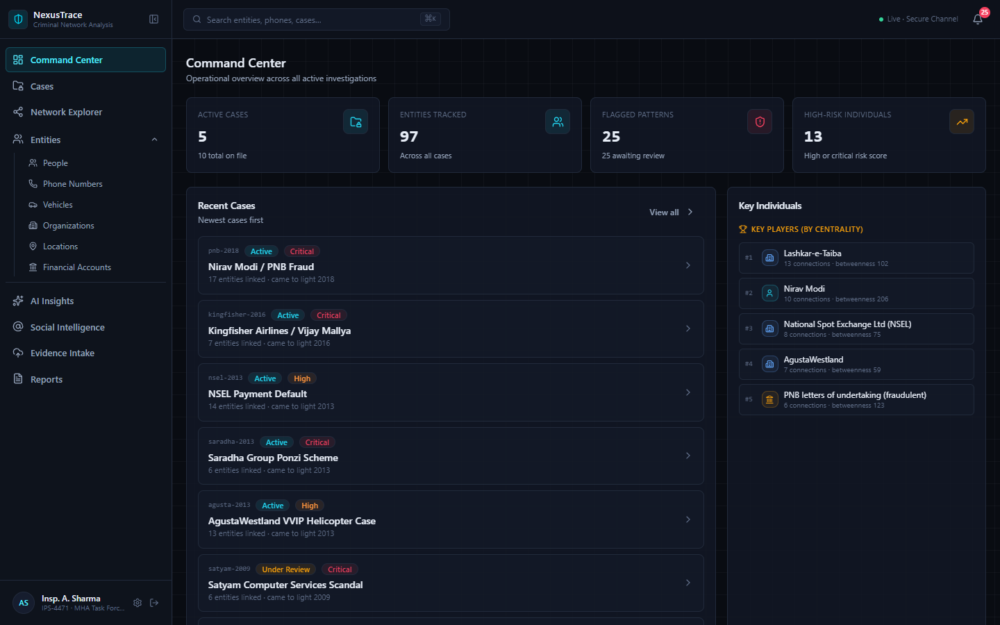<br><sub><b>Command Center</b>: caseload, flagged patterns and the most central people and organisations</sub></td>
<td width="50%">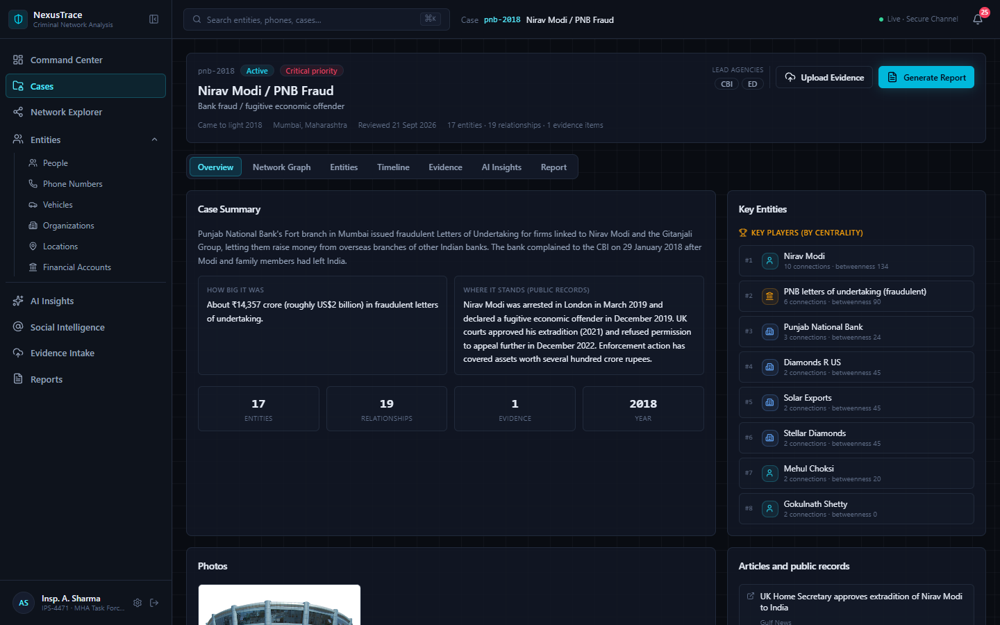<br><sub><b>Case workspace</b>: summary, public-record status, key entities, photos and sources</sub></td>
</tr>
<tr>
<td>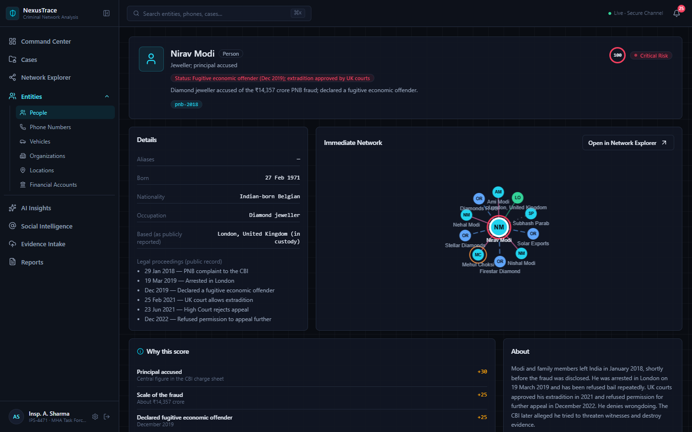<br><sub><b>Entity profile</b>: legal proceedings, immediate network and <i>why this score</i></sub></td>
<td>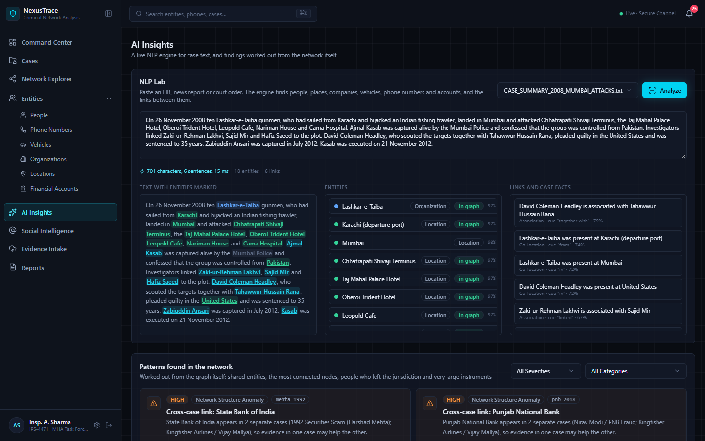<br><sub><b>NLP Lab</b>: entities marked in the text, matched to the graph, with the links between them</sub></td>
</tr>
<tr>
<td>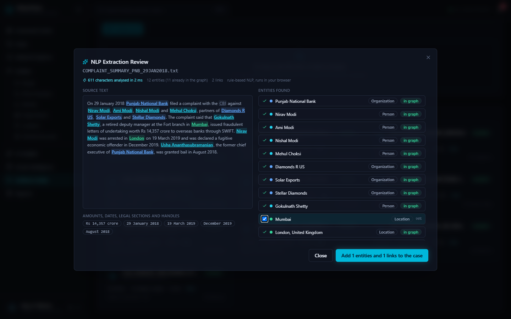<br><sub><b>Evidence Intake</b>: the investigator reviews what the engine found before anything is added</sub></td>
<td>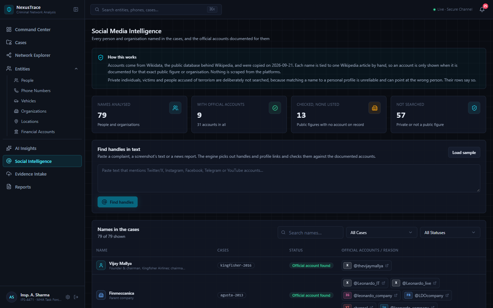<br><sub><b>Social Media Intelligence</b>: documented official accounts only, with the reason for every row</sub></td>
</tr>
<tr>
<td>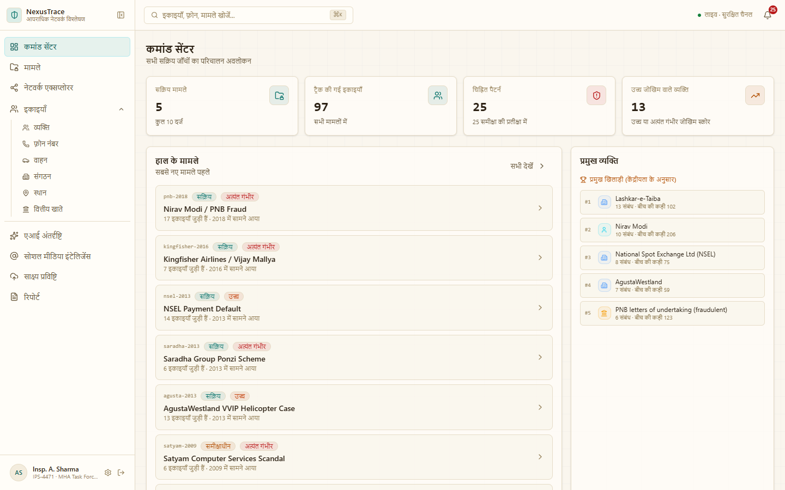<br><sub><b>Languages and themes</b>: the dashboard in Hindi with the <i>Warm Paper</i> light theme</sub></td>
<td>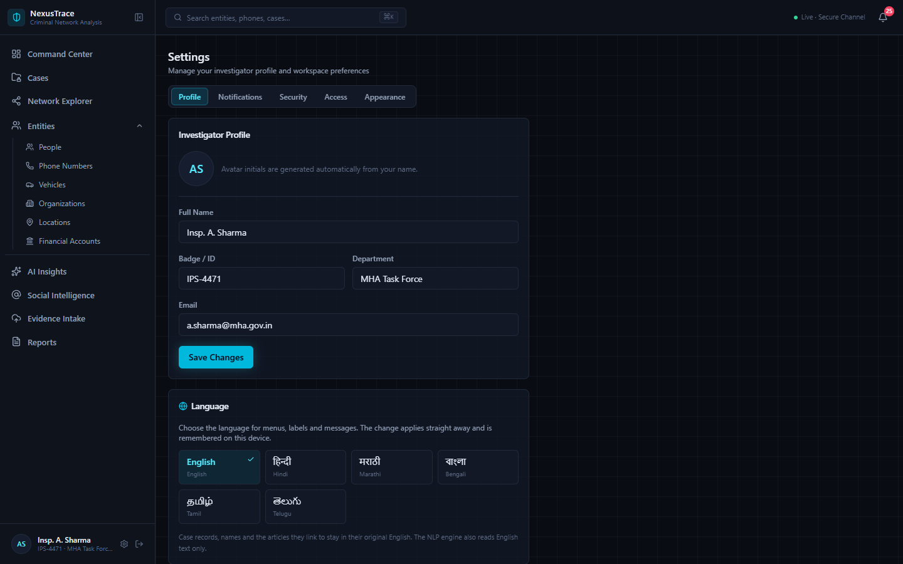<br><sub><b>Settings</b>: profile, 2FA and sessions, access requests, language and theme</sub></td>
</tr>
<tr>
<td>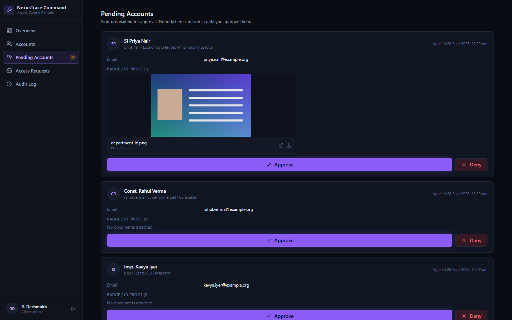<br><sub><b>Admin console, Pending Accounts</b>: approve or deny each sign-up after checking the attached ID</sub></td>
<td>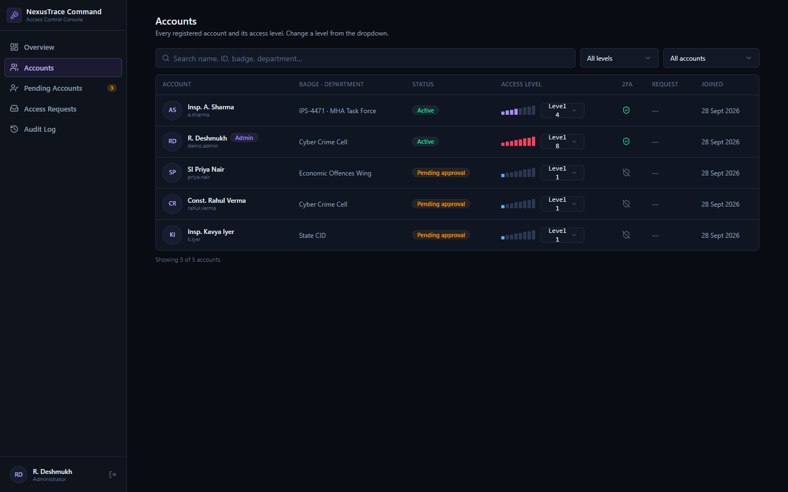<br><sub><b>Admin console, Accounts</b>: status, access level and 2FA for everyone</sub></td>
</tr>
<tr>
<td colspan="2" align="center">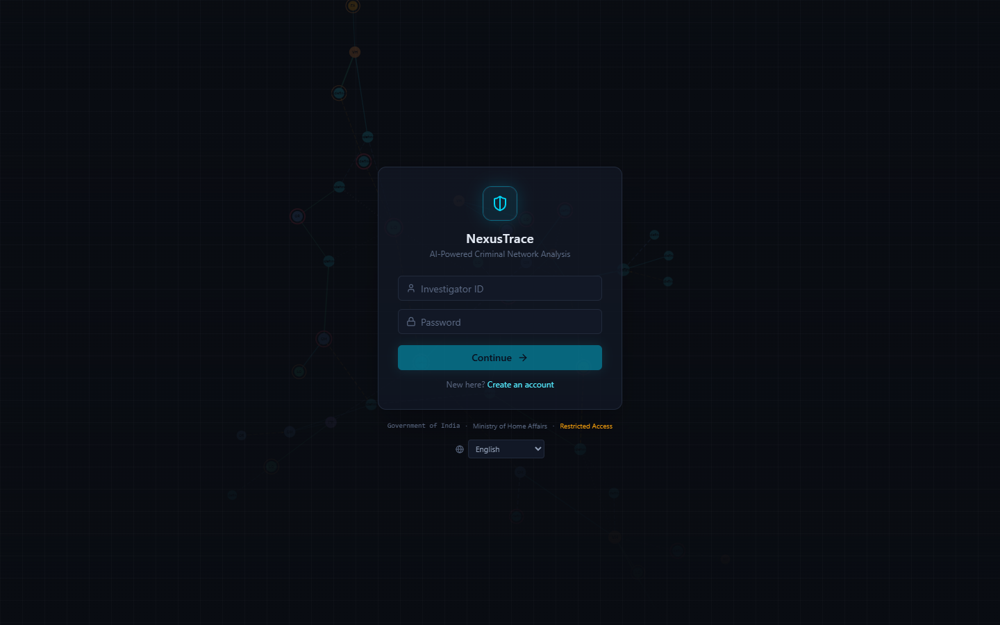<br><sub><b>Sign-in</b>: password, then a code from an authenticator app</sub></td>
</tr>
</table>

## About the data

The ten case files (the 26/11 Mumbai attacks, the Bhopal gas disaster, the 1992 Harshad Mehta securities scam, Satyam, the 2G spectrum case, Nirav Modi / PNB, NSEL, Saradha, Kingfisher / Vijay Mallya and AgustaWestland) are compiled from public reporting and court records, with a source link for every claim. They are here to demonstrate the software, not to make findings about anyone.

- Legal status is shown as reported when the files were compiled and may have changed since.
- Being named in a case does not mean a person was charged or convicted. Several people in these cases were acquitted (for example, a special court acquitted all accused in the 2G spectrum case in 2017), and people with no alleged wrongdoing are marked *No wrongdoing alleged*.
- Risk scores show how the tool explains its reasoning. They are not assessments of real people.
- The files contain no personal phone numbers or home addresses: only company registered offices, crime locations and facts that are in published sources. Photos are openly licensed pictures from Wikimedia Commons, credited in the app.

If you find something inaccurate, please open an issue.

## Run it

```bash
npm install
npm run dev
```

`npm run dev` starts two things together: the website (Vite, `http://localhost:5173`) and the API (`server/`, port 3001). Vite forwards `/api` requests to the API, so just use the 5173 address. **Node 22 or newer** is required (install the current LTS from nodejs.org).

There are two websites on that one server:

| | Address | For |
|---|---|---|
| NexusTrace | `http://localhost:5173/` | investigators |
| NexusTrace Command (admin console) | `http://localhost:5173/admin/` | the head of department: sign-up approvals, accounts, access levels, access requests |

On the first run in development the API creates a demo account and prints it in the terminal: ID `a.sharma`, password `NexusTrace#2026` (change it in **Settings → Security**). To open the admin console, make an account an administrator from the command line (see *Access levels and the admin console*).

### Signing up and signing in

**Create an account** on the login page is a short wizard:

1. Name, email, an Investigator ID (or email) and a password of 10+ characters.
2. Department and position, plus optional proof of identity: a badge or ID scan (1 to 3 files, PDF/PNG/JPEG, 5 MB each).
3. A confirmation that the account is **waiting for an administrator's approval**. Until then, signing in shows that message and nothing else.
4. Once approved, the first sign-in asks the person to scan a QR code with **Google Authenticator, Microsoft Authenticator or Authy** (any TOTP app), confirm a 6-digit code and save 10 one-time backup codes. Every sign-in after that needs the password *and* a code from the app.

Accounts created from the command line (`npm run user -- create ...`) are active straight away and skip the approval step.

**Restricting who can sign up.** Start the API with `SIGNUP_OPEN=false` and the "Create an account" link disappears and the API refuses sign-ups; add people with `npm run user -- create ...` instead.

### Access levels and the admin console

Every account has an **access level from 1 to 8** (new accounts start at 1). What each level can see is not enforced yet: the level is stored, shown to the person (Settings → Access, and `L3` in the sidebar) and available to the API as `accessLevel`, ready to be checked once the rules are decided.

**Signing in to the admin console** needs an account with the *administrator* role, plus password and authenticator code like everywhere else. Give someone that role from the command line (there is deliberately no button for it in the website):

```bash
npm run user -- make-admin <username>       # e.g. your own account
npm run user -- remove-admin <username>     # locks them out of the console immediately
```

In the console the administrator can:

- review **Pending Accounts**: each sign-up's details and attached ID documents, then **approve** it (the person can sign in and set up 2FA) or **deny** it with a reason (the sign-up is deleted, so the same ID can apply again);
- see every account with its status, level, 2FA and any waiting request (**Accounts**), and change a level by hand;
- open an account to **edit** its name, badge, department and position, **suspend** it with a reason (it can't sign in and all its sessions end at once, but nothing is deleted) and lift the suspension later, or **delete** it permanently (type the ID to confirm; the account and everything attached to it is removed, and the person could sign up again);
- read **Access Requests**: the reason and the identity documents people attached, then approve at any level they choose (it can differ from what was asked) or deny with a note;
- look back at every change in the **Audit Log** (who, what, when, and the note). Names are copied into each entry, so the trail survives an account being deleted.

An administrator can't suspend or delete their own account, or the last remaining administrator.

Investigators ask for more access in **Settings → Access**: pick a higher level, write the reason (20+ characters) and attach an ID scan or photo (1 to 3 files, PDF/PNG/JPEG, 5 MB each). One request can be open at a time and can be withdrawn. They see the decision and the administrator's note there.

The two websites have separate sign-ins (cookies `nt_session` and `nt_admin_session`), so signing in to one does not sign you in to the other, and the console session expires after 2 hours.

### Managing users

```bash
npm run user -- list                        # shows level, role, and PENDING / BANNED status
npm run user -- create <username> <password> --name "Full Name" --badge IPS-1234 --department "Unit" --position "Inspector" --email a@b.gov.in [--admin] [--level 1-8]
npm run user -- set-level <username> <1-8>
npm run user -- make-admin <username>
npm run user -- reset-password <username> <new-password>
npm run user -- reset-2fa <username>      # lost phone: they re-enrol at next sign-in
npm run user -- delete <username>
```

### Running as one server (demo / deployment)

```bash
npm run build
npm start          # serves both websites (/ and /admin/) and the API on one port (3001, or $PORT)
```

To put it on the internet (an Ubuntu server on Azure, a domain, automatic HTTPS, auto-restart) follow [DEPLOY.md](DEPLOY.md); the scripts it uses are in `deploy/`.

## Languages and themes

- **Languages:** English, Hindi, Marathi, Bengali, Tamil and Telugu. Pick one on the login page or in **Settings → Profile**; the choice is remembered on the device. Menus, labels and messages are translated; case records, names and the articles they link to stay in their original English, and the NLP engine reads English text. Any string without a translation falls back to English, so a missing entry never breaks a page. Dictionaries are plain TypeScript in `src/i18n/locales/`, checked against the English source (`src/i18n/en.ts`) by the compiler.
- **Themes:** *Cyan Ops* (dark, the default), *Amber Watch* (dark), *Daylight Blue* (light) and *Warm Paper* (light), in **Settings → Appearance**. Each theme redefines the colour variables that Tailwind's classes read (`src/index.css`), so every page follows without per-component changes. The theme is applied before the first paint, so there is no flash of the wrong colours.

## Backend (`server/`)

Express + SQLite (`better-sqlite3`), written in TypeScript. Data lives in `server/data/` (created on first run, git-ignored):

- `nexustrace.db`: users (with role, access level and account status), sessions, backup codes, sign-up and access-request documents, and the audit log
- `app.key`: encrypts each user's authenticator secret and every uploaded document. **Never commit it.** If it is lost, every user has to re-enrol 2FA (`reset-2fa`). Set `APP_SECRET_KEY` (64 hex chars) to supply your own key instead.

New columns are added by small migrations at start-up, so an existing database upgrades in place. Accounts that existed before the approval step was introduced stay active.

How sign-in is protected:

- Passwords are hashed with bcrypt; wrong-user and wrong-password look identical; 5 failures lock the account for 15 minutes.
- Accounts waiting for approval and suspended accounts are refused after the password check, before any session is created. Suspending an account also ends all its sessions.
- After the password, the server issues a short-lived *pending* session that cannot access anything until the 2FA code is accepted, and is replaced by a brand new session token once it is.
- TOTP codes are checked on the server with a ±30 s clock allowance, and a code can't be reused (replay protection). 5 wrong codes end the sign-in attempt.
- Sessions are random tokens in an `HttpOnly`, `SameSite=Lax` cookie (only their hash is stored), last 8 hours, and can be revoked from **Settings → Security → Active Sessions**.
- Uploaded documents are checked by their content (only real PDF/PNG/JPEG files are accepted, whatever the file is called) and stored **encrypted** (AES-256-GCM) with the same key as the authenticator secrets. Only signed-in administrators can open them.
- A session only works on the site it was created for, and the admin console re-checks the administrator role on every request, so removing the role takes effect at once.
- Requests are rate-limited, security headers come from `helmet`, and state-changing requests from another site are rejected (a page is trusted when it was served from the same host and port it sends the request to, so any dev port works).

Configuration (all optional): `SIGNUP_OPEN` (default `true`), `API_PORT` (dev, default 3001), `PORT` (production), `HOST` (default `127.0.0.1`), `CLIENT_ORIGIN` (comma-separated extra allowed origins), `COOKIE_SECURE=true` (when served over HTTPS), `DEMO_PASSWORD`, `APP_SECRET_KEY`, `DATA_DIR`.

Run only one `npm run dev` at a time: a second one can't use port 3001, and Vite silently moves to 5174.

If `npm install` fails on `better-sqlite3` (a native module), install the Visual Studio "Desktop development with C++" build tools, or use a Node version that has a prebuilt binary.

## NLP engine

Paste an FIR, a news report or a court order into **Evidence Intake** or the **AI Insights → NLP Lab**, and the engine finds:

- people (with aliases: "Sajid Mir, alias Wasi"), companies, places, vehicle plates, phone numbers and bank accounts;
- who is in the graph already (fuzzy matching: "Mehta" = "Harshad Mehta", "Union Carbide" = "Union Carbide Corporation", "NSEL" = "National Spot Exchange Ltd (NSEL)");
- the links between them ("son of", "transferred", "was arrested in", "co-accused"), each with the words that triggered it and a confidence;
- amounts, dates, legal sections, social media handles and a crime category.

Investigating agencies and officials are recognised but kept out of the network. In the review window the investigator ticks what to add and it goes into the case graph. It is rule-based (tokeniser, sentence splitter, gazetteers, cue rules, Jaro-Winkler matching), so it takes a few milliseconds and nothing leaves the browser. Word lists are plain data in `src/nlp/lexicon.ts`. `npx tsx src/nlp/selfcheck.ts` runs sample texts and checks the expected results are found.

Text added on Evidence Intake, and entities added from the review window, live in the browser only (they are gone after a reload); the ten cases come from the server each time.

## Importing many cases from one file

**Cases → Import from file** (or the *Import from file* tab of *New Case*) turns a CSV or Excel file into many cases at once, one case per row.

1. Drop a `.csv` or `.xlsx` (up to 5 MB and 500 rows; the first row must be column names). *Download template* gives a CSV to start from. Old `.xls` files are refused with a message asking to save as `.xlsx` or CSV. The file is read in the browser and never uploaded.
2. Columns are matched to case fields by their names ("Case Name", "Type of Crime", "FIR Year", "Accused Names", …). The page shows what it matched and lets you change any of them. If a workbook has several sheets you pick one.
3. A preview lists every case that will be created, with notes on problems: a row with no title, a title that already exists (or repeats an earlier row) is left out by default, and an unknown status, priority or year falls back to a default with a warning. Untick any row to leave it out.
4. Only a **title** is needed. Other columns: description, category, status, priority, year, place, lead agency (separate several with `;`), impact, outcome, people and organisations (separate names with `;`).
5. *Create* adds the cases. Names in the people and organisations columns become entities in the case. With *Read each description with the NLP engine* ticked (the default), people, companies, places and the links between them found in each description are added too. A name that is already in the graph, or appears in several rows, is one entity that belongs to each of those cases, which is how cross-case links show up.

Imported cases are held in the browser like anything added on Evidence Intake: they are not stored on the server and are gone after a reload. The code is in `src/lib/tabular.ts` (CSV parser and lazy-loaded Excel reader, using `read-excel-file`), `src/data/caseImport.ts` (column matching, validation and the import) and `src/components/cases/ImportCasesPanel.tsx`.

## Social media intelligence

The **Social Intelligence** page lists every person and organisation in the cases and what is documented about their official social media accounts.

- **Where accounts come from:** Wikidata (the public database behind Wikipedia). `server/dataset/fetch-social.ts` ties each public figure or organisation to one Wikipedia article by hand, reads the accounts Wikidata documents for it (X, Instagram, Facebook, YouTube, LinkedIn, official website) and writes `server/dataset/social.ts`. Run `npx tsx server/dataset/fetch-social.ts` to refresh it. The app never calls Wikidata or any social platform at run time, so it works offline and shows the same thing every time.
- **Each name gets one of three statuses:** *Official account found*, *Checked, none listed*, or *Not searched*. The page says why for every row.
- **Not searched, on purpose:** private individuals, victims and people accused of terrorism. Matching a name to a personal profile is unreliable and can point at the wrong person, and there is no source to cite. The tool does not scrape platforms, call platform APIs or generate search links for a person.
- **Handle finder:** paste text (a complaint, a screenshot's text, a news report) and the engine picks out handles and profile links (`src/nlp/handles.ts`). Each one is checked against the documented accounts: a match points to the person or organisation in the case, anything else is flagged for a person to review. The same handles appear as facts in the NLP Lab and the Evidence Intake review window.
- Entity pages for people and organisations show a *Social media presence* card with the same information and its source.

To add a name, add its entity id and exact English Wikipedia title to `CHECKED` in `fetch-social.ts` and run the script. Only add public figures and organisations, and check that the article is about the same entity as the one in the case (a parent company or a scandal with the same name is a different thing).

## Stack

| Layer | What we used |
|---|---|
| Frontend | React 19 + TypeScript, Vite, React Router, Tailwind CSS v4, Radix UI primitives (hand-styled in `src/components/ui`), Framer Motion, lucide icons |
| Graphs and charts | `react-force-graph-2d` and D3 for the network graph, Recharts for dashboard analytics |
| NLP | Our own rule-based engine in `src/nlp/` (tokeniser, gazetteers, cue rules, Jaro-Winkler matching); no external AI service |
| Backend | Node.js 22 + Express 5, run as TypeScript with `tsx`; Zod for request validation; `helmet` and `express-rate-limit` |
| Data | SQLite through `better-sqlite3` (WAL mode, foreign keys); the case dataset as typed TypeScript modules |
| Security | bcrypt passwords, TOTP 2FA (`otplib`) with backup codes, AES-256-GCM encryption for secrets and uploads, `HttpOnly` session cookies per site, role and access-level checks, audit log |
| i18n and themes | Hand-rolled translation layer (`src/i18n`) and CSS-variable themes (`src/theme`) |
| Deployment | One Ubuntu 24.04 VM, `systemd` for the service, Caddy for automatic HTTPS (see [DEPLOY.md](DEPLOY.md)) |

## Structure

- `src/types`: shared TypeScript interfaces (entities, relationships, cases, events, alerts, evidence)
- `src/data`: the in-browser store (filled after sign-in by `loader.ts`) plus helper functions (`computeCentrality`, `findShortestPath`, per-case lookups, `computeAlerts`: patterns worked out from the graph itself)
- `src/nlp`: the NLP engine (`extract.ts`, `lexicon.ts`, `handles.ts`, `toGraph.ts`, `selfcheck.ts`)
- `src/data/social.ts`, `src/components/social`, `src/pages/SocialIntelligence.tsx`: the social media intelligence page and card
- `src/lib/tabular.ts`, `src/data/caseImport.ts`, `src/components/cases`: importing cases from CSV / Excel
- `src/components/graph`: the network graph, filters, legend, node detail panel, key-players ranking
- `src/components/layout`: sidebar, topbar, command palette (⌘K)
- `src/components/evidence`: AI extraction review modal
- `src/i18n`: translation layer, English source strings and the five regional dictionaries; `src/components/settings/LanguagePicker.tsx`
- `src/theme`: theme definitions and provider; `src/components/settings/ThemePicker.tsx`
- `src/pages`: one file per route (Login, Dashboard, Cases, Case Workspace, Network Explorer, Entity Registry/Profile, AI Insights, Social Intelligence, Evidence Intake, Reports, Settings)
- `src/context/AuthContext.tsx`, `src/lib/api.ts`, `src/components/auth`: frontend side of sign-up and sign-in (session, route protection, 2FA UI)
- `admin/index.html`, `src/admin/`: the admin console (its own sign-in, pages and styling; it reuses the shared components and talks to `/api/admin`), including `pages/PendingAccounts.tsx` for sign-up approvals
- `src/components/settings/AccessPanel.tsx`: the investigator's Access tab (current level, request form, history)
- `server/`: the API (see *Backend* above); `signupFiles.ts` stores the ID documents attached to sign-ups
- `server/dataset/`: the ten real cases: `cases.ts`, `entities.ts`, `relationships.ts`, `events.ts`, `evidence.ts`, `social.ts` (generated, see *Social media intelligence*), and `build.ts` (helpers that build entities, risk factors and Commons image links). `checkDataset()` runs at start-up and logs anything inconsistent (duplicate ids, or links, events and documents that point at something that doesn't exist). Risk scores are always worked out from their `riskFactors`, so a score can't disagree with its reasons.
- `deploy/`, `DEPLOY.md`: server setup and update scripts
- `docs/screenshots/`: the images in this README

## Notes for extending this

- To add a case, add its records under `server/dataset/` and follow the shapes in `src/types`. Give each entity a risk score made of `riskFactors` (label, points, detail) so the page can explain it, and a source link for every claim. Restart the server; the rest of the app (graph, centrality ranking, entity profiles, alerts, tables) needs no changes.
- Only add pictures that are openly licensed (Wikimedia Commons), with their credit and licence. The server's Content-Security-Policy allows images from `upload.wikimedia.org`, `thumb.wikimedia.org` and `commons.wikimedia.org` and nowhere else; change `img-src` in `server/index.ts` if you use another source.
- To add a language, copy an existing file in `src/i18n/locales/`, translate the strings, and register it in `src/i18n/core.ts`. To add a theme, add its colour variables in `src/index.css` and an entry in `src/theme/core.ts`.
- The app needs the API for sign-in and for the case data, so it cannot be hosted as a static site; follow [DEPLOY.md](DEPLOY.md).
